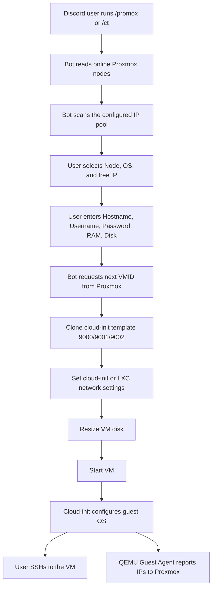

# Proxmox Auto VM

Discord bot for creating Proxmox VMs from a slash command. Users run `/promox`, choose the node, OS, and free IP address, then enter VM name, username, password, RAM, and disk size. The bot clones a cloud-init template, applies the selected settings, starts the VM, and returns SSH details.

> Public repository note: do not commit `.env`. Use `.env.example` as the template.

## Workflow Map



## OS Templates

| Key | Name | Template ID |
| --- | --- | --- |
| `ubuntu-2404` | Ubuntu 24.04 | `9000` |
| `debian-13` | Debian 13 | `9001` |
| `alpine` | Alpine low RAM | `9002` |

The templates should have:

- cloud-init installed and enabled
- SSH password authentication enabled
- `qemu-guest-agent` installed and enabled
- Proxmox VM option `agent: enabled=1`

## CT Templates

Set CT template volume IDs in `.env`:

```text
CT_STORAGE=your-container-storage-name
CT_BRIDGE=vmbr0
CT_TEMPLATE_DEBIAN_12=storage-name:vztmpl/debian-template.tar.zst
CT_TEMPLATE_ALPINE_323=storage-name:vztmpl/alpine-template.tar.xz
```

The `/ct` command creates an unprivileged LXC container with nesting enabled, static IP, root password, DNS, and gateway.

## IP Pool

Configure the IP pool with environment variables:

```text
IP_PREFIX=192.0.2
IP_HOST_RANGES=20-35,41-49
IP_EXCLUDE_HOSTS=42
```

An IP is considered free when ping does not respond and the local ARP neighbor table does not show it as active.

## Environment

Copy the example file and fill in real values on the server:

```bash
cp .env.example .env
```

Required variables:

```text
DISCORD_TOKEN
PVE_HOST
PVE_TOKEN_ID
PVE_TOKEN_SECRET
PVE_TEMPLATE_NODE
PVE_TEMPLATE_ID
PVE_STORAGE
CT_STORAGE
CT_BRIDGE
CT_TEMPLATE_DEBIAN_12
CT_TEMPLATE_ALPINE_323
GATEWAY
NAMESERVER
IP_PREFIX
IP_HOST_RANGES
IP_EXCLUDE_HOSTS
```

## Python Run

```bash
python3 -m venv .venv
. .venv/bin/activate
pip install -r requirements.txt
python bot.py
```

## Systemd Deploy

The current production layout is:

```text
/opt/proxmox-auto-vm
├── .env
├── .venv/
└── bot.py
```

Install service:

```bash
cp systemd/proxmoxauto-bot.service /etc/systemd/system/proxmoxauto-bot.service
systemctl daemon-reload
systemctl enable --now proxmoxauto-bot.service
systemctl status proxmoxauto-bot.service
```

## Repository Contents

- `bot.py`: Python Discord bot source.
- `systemd/proxmoxauto-bot.service`: systemd unit used by the service.
- `.env.example`: safe placeholder environment file.
